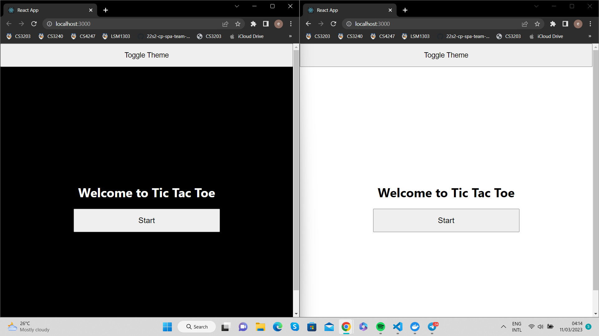
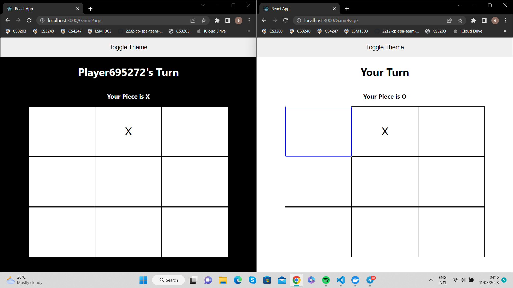
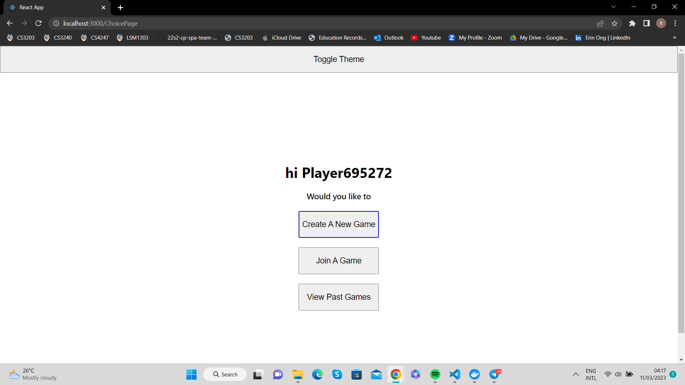
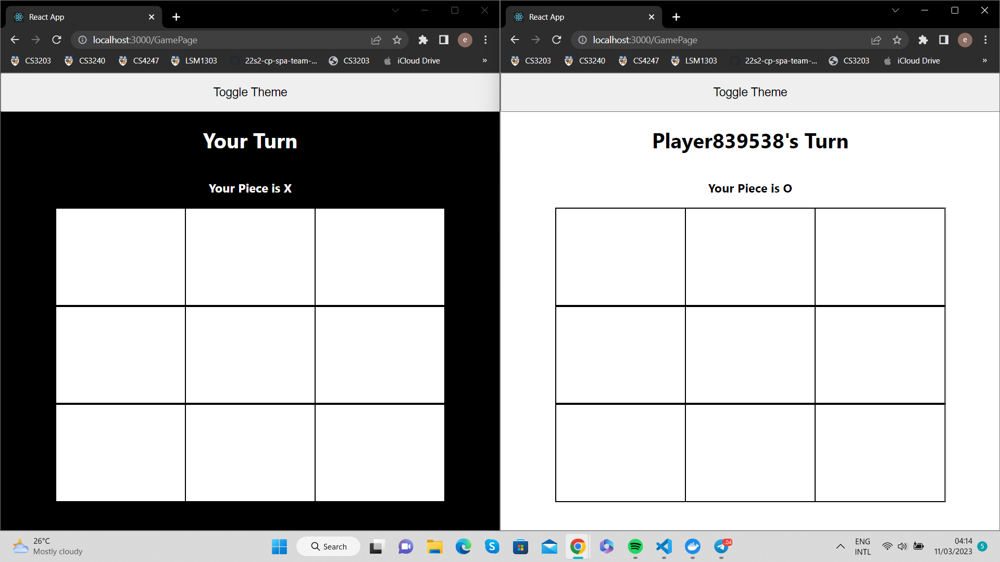
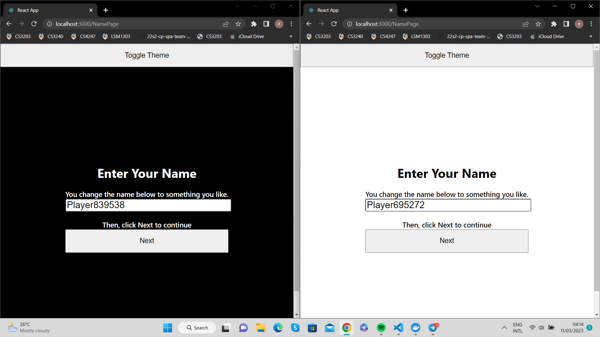
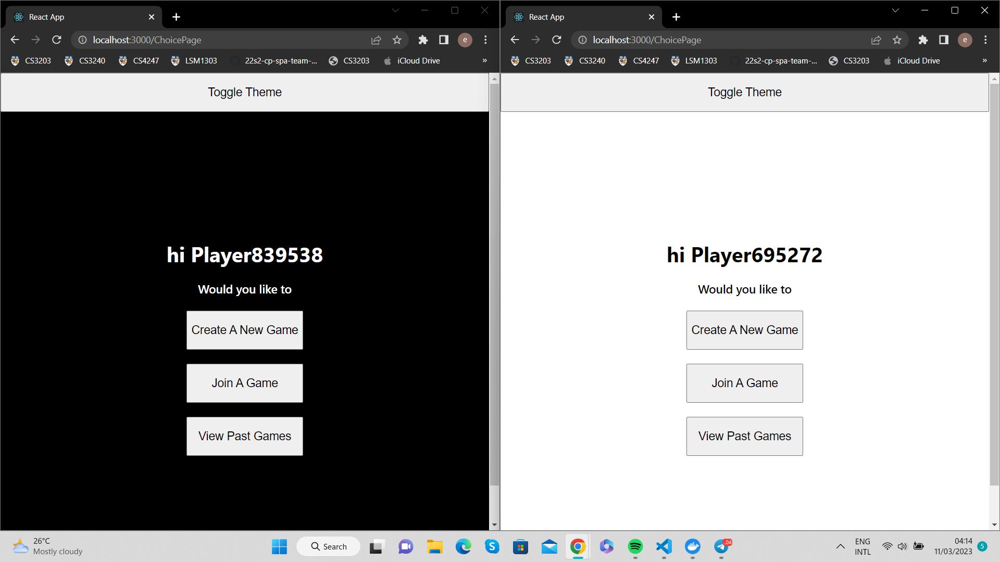
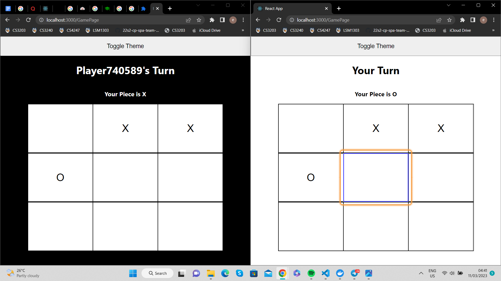
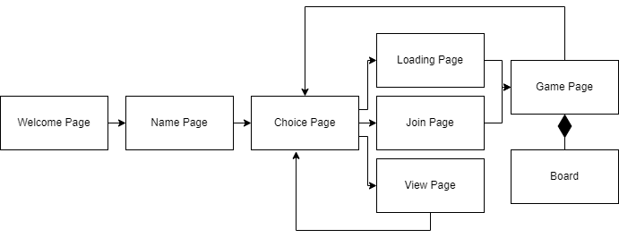
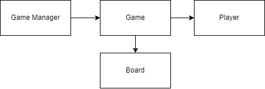
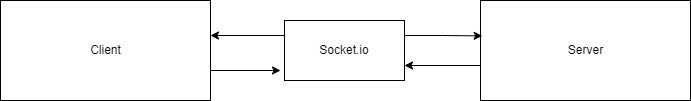

# Inclusive Tic Tac Toe Documentation 

# Using Terminal

1. Ensures Node.js and npm are installed on your local machine. Else, you can download it [here](https://nodejs.org/en/download/).

2. Clone the repository by running the following command in your terminal 
```
git clone https://github.com/greyguy21/inclusive-tic-tac-toe
```

3. Change directory into `inclusive-tic-tac-toe` folder
```
cd inclusive-tic-tac-toe
```

### Setting up Server
4. Change directory into `server` folder
```
cd server
```

5. Run the the command to install the necessary dependencies
```
npm install
```

6. Run the command to start the server
```
npm run dev
```

### Setting up Client 
7. Open another terminal

8. Ensure you are in `/inclusive-tic-tac-toe/client` directory. 

9. Run the the command to install the necessary dependencies
```
npm install
```

10. Run the command to start the client 
```
npm start
```

11. Application will be running on http://localhost:3000. Use the same link to open the application on 2 or more browsers. 

&nbsp; 

# Using Docker
1. Ensures Node.js and npm are installed on your local machine. Else, you can download it [here](https://nodejs.org/en/download/).

1. Ensures Docker Desktop is installed on your local machine. Else, you can download it [here](https://www.docker.com/products/docker-desktop/).

2. Clone the repository by running the following command in your terminal 
```
git clone https://github.com/greyguy21/inclusive-tic-tac-toe
```

3. Change directory into `inclusive-tic-tac-toe` folder
```
cd inclusive-tic-tac-toe
```

4. Run command to load the web application 
```
 docker-compose up --build
```

5. Application will be running on http://localhost:3000. Use the same link to open the application on 2 or more browsers. 

&nbsp; 

# Summary on Design Decisions
Accessibility considerations were mainly focused on individuals with visual, cognitive and motor impairments and as I feel that it would be more challenging for them to access a game application online. They also share common needs such as keyboard accessibility. Keyboard accessibility is important for users of screen readers as well as users with motor impairments as they are keyboard-only users. It is needed for them to be able to navigate around the app and also play the game. Adding on to needs for screen reader users, aria-labeling is included so that the application would be compatible with the assistive technology and be more accessible to more potential players. 

The interface of the app was also kept simple and succinct so that users are able to navigate from page to page smoothly without distractions. The flow of the app is logical and intuitive which allows those with cognitive impairments to follow with less difficulty. One-liner instructions are also provided to help guide them from step to step. Components are also focus visible with a blue outline when using the keyboard to navigate so users will know at which point they are on the application. 

For individuals with low vision or light sensitivity, color contrast is maintained to allow legibility and dark mode is also provided to reduce strain on the eyes. 

Buttons and tic-tac-toe squares are made large enough so that they are of a good clickable size as for those with motor impairments who are mouse users may have difficulty clicking on a small area. 

Some improvements and other design considerations would be to allow users to customize the size of the components (e.g. text) and also enable the use of up and down arrow keys within the game to allow a smoother experience. 

&nbsp; 

# Design Decisions 
## Light and Dark Contrast

With consideration for light-sensitive individuals, the function to toggle theme is available to switch to dark mode. 

In addition, contrast between the background and content is also maintained so that individuals with low vision are able to tell the colors apart. 



## Keyboard Accessible 
For keyboard-only users, all functionalities are accessible from the keyboard. The tic-tac-toe squares are highlighted to show which box the player is currently on. 


## Focus Visible 
Buttons are also highlighted to bring focus to which component the individual is currently on. 


## Clickability
Button sizes are deliberately enlarged to allow a wider clickable surface, which is a consideration for individuals who may have trouble controlling the mouse and are unable to precisely click on a small area. 


## Organized Flow
Game set up tasks (Choosing name, Choosing to create or join room etc.) are broken down into smaller steps. Simple instructions are also provided to guide individuals with cognitive impairment to set up their game. 

Default player names are also provided so that individuals who have trouble typing on the keyboard can proceed directly to the game. 



## Simple Interface 
Interface is also kept simple with minimal elements so that the application is easy to navigate and the purpose of the elements are straightforward and not distracting. 


## Screen Reader Compatible
Aria-labels are used in components to help individuals who use screen readers better navigate the application. For example, each tic tac toe square is labeled by its position and current state, so the individuals can better understand the state of the game and whether a box is available. 


&nbsp; 

# API 
Socket.io is used to establish connection between clients and server. Client emits events and passes arguments to Server. Client also listens to events from the Server and receives data from Server. Server does the same with Client, since the connection is bidirectional. 

&nbsp; 

### createNewGame, {playerName}
> Event emitted from Client to Server. 
Server receives playerName and creates a new game. 

### newGameCreated, {gameID}
> Event emitted from Server to Client. 
Client receives game ID for game created by Server.

### joinRoom, {playerName, gameID}
> Event emitted from Client to Server. 
Server receives playerName and gameID and lets the player with playerName join the game with .gameID. 

### goToGamePage
> Event emitted from Server to Client. 
Client receives the event to proceed to the game page.  

### joinError
> Event emitted from Server to Client. 
Client receives the event that player is unable to join the game successfully. 

### startGame, {playerName, gameID}
> Event emitted from Client to Server. 
Server receives playerName and gameID to initialize the game with gameID and playerName. 

### gameStarted, {board, piece, next, opponentName}
> Event emitted from Server to Client. 
Client receives state of board, player’s piece, which player’s turn and opponent’s name to initialize the game. 

### move, {playerName, gameID, index, piece}
> Event emitted from Client to Server. 
Server receives an event to update game with gameID with playerName, index and piece. 

### update, {board, next}
> Event emitted from Server to Client. 
Client receives current state of board and which player’s turn for the next round.

### won, {newBoard}
> Event emitted from Server to Client. 
Client receives the final board after player has won. 

### opponentWon, {newBoard}
> Event emitted from Server to Client. 
Client receives the final board after the opponent has won. 

### draw, {newBoard}
> Event emitted from Server to Client. 
Client receives the final board after the two players in the game have drawn.

### playAgain, {gameID}
> Event emitted from Client to Server. 
Server receives the gameID of the game to reset. 

### gameReset, {newBoard, next}
> Event emitted from Server to Client. 
Client receives a new board and starting player for new game. 

### getResults
> Event emitted from Client to Server. 
Server receives events to get results of past games.

### results, {results}
> Event emitted from Server to Client. 
Client receives results of past games. 

### leave, {gameID}
> Event emitted from Client to Server. 
Server receives gameID of game to close. 

### left
> Event emitted from Server to Client. 
Client receives an event to leave the game.

&nbsp;

# Architecture Diagrams 

## Frontend 


## Backend 


## High-Level Architecture Diagram



&nbsp; 

# Bugs 
1. When navigating to previous page from view page, users need to press the back button 2 times. 


